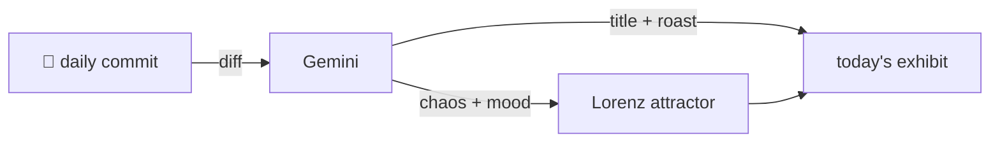

### Hey 👋

I'm Urav. I build things with code.

---

#### 📌 Featured Commit

Every day a bot grabs a commit (one of mine, someone I follow, or a stranger's), an AI names and roasts it, and it ends up as a strange attractor.

<!-- ENTROPY:START -->

### Catalytic Sound Sculpt

Chaos ████████░░ 85 · Mood $\color{#FFBF00}{\blacksquare}$ #FFBF00

[palmier-io/palmier-pro](https://github.com/palmier-io/palmier-pro) by [@htin1](https://github.com/htin1) · [`e3e3e0d`](https://github.com/palmier-io/palmier-pro/commit/e3e3e0d51e6ebddb4ac8bb86112a9c5931676169)

~~~
[feat] Support Seed Audio generation (#411)

* [feat] Support Seed Audio generation

* [cleanup] Simplify Seed Audio submission
~~~

This commit unleashes serious generative power, skillfully integrating image and audio references across the entire stack. From precise schema updates and validation to a reimagined UI for handling diverse inputs, this is far more than just adding fields. It’s a deep structural expansion enabling genuinely complex audio creation.

captured 2026-07-26

<!-- ENTROPY:END -->

---

What is this?

 

A GitHub Action runs daily and picks a commit: mine if I've pushed recently, otherwise something from my network or a starred repo, and the Linux genesis commit as a last resort. Gemini gives it a name, a roast, a chaos score (0-100), and a mood color. Those become a [Lorenz attractor](https://en.wikipedia.org/wiki/Lorenz_system): chaos controls how wild the butterfly gets, mood tints the gradient, and the commit hash sets the starting point. The math is identical every run, so the commit is the only thing that changes the picture.

[See the code →](./entropy)

