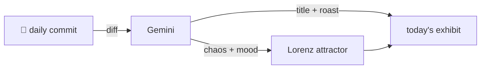

### Hey 👋

I'm Urav. I build things with code.

---

#### 📌 Featured Commit

Every day a bot grabs a commit (one of mine, someone I follow, or a stranger's), an AI names and roasts it, and it ends up as a strange attractor.

<!-- ENTROPY:START -->

### AI Governance Facelift

Chaos ██░░░░░░░░ 20 · Mood $\color{#607D8B}{\blacksquare}$ #607D8B

[github/spec-kit](https://github.com/github/spec-kit) by [@github-actions[bot]](https://github.com/github-actions[bot]) · [`e7ec7c1`](https://github.com/github/spec-kit/commit/e7ec7c190f715b5d3e39b4fe69d4571e27c4b834)

~~~
Update SicarioSpec Core preset to v0.5.1 (#3165)

Update sicario-core preset submitted by @SiCar10mw:
- presets/catalog.community.json (version, download_url, description, tags)
- docs/community/presets.md community presets table

…
~~~

An AI-driven bot, assisted by yet another AI, is updating the descriptive prose for a 'security governance' preset. The shift from an 'evidence-first' process to a 'baseline secure-by-default' profile, alongside dropping the general 'security' tag, smells like rebranding to soften the image. Typical maintenance, just fully automated now.

captured 2026-06-26

<!-- ENTROPY:END -->

---

What is this?

 

A GitHub Action runs daily and picks a commit: mine if I've pushed recently, otherwise something from my network or a starred repo, and the Linux genesis commit as a last resort. Gemini gives it a name, a roast, a chaos score (0-100), and a mood color. Those become a [Lorenz attractor](https://en.wikipedia.org/wiki/Lorenz_system): chaos controls how wild the butterfly gets, mood tints the gradient, and the commit hash sets the starting point. The math is identical every run, so the commit is the only thing that changes the picture.

[See the code →](./entropy)

