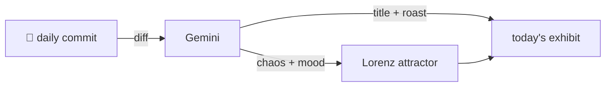

### Hey 👋

I'm Urav. I build things with code.

---

#### 📌 Featured Commit

Every day a bot grabs a commit (one of mine, someone I follow, or a stranger's), an AI names and roasts it, and it ends up as a strange attractor.

<!-- ENTROPY:START -->

### Lifecycle Locked Down

Chaos ███████░░░ 75 · Mood $\color{#313a48}{\blacksquare}$ #313a48

[affaan-m/ECC](https://github.com/affaan-m/ECC) by [@haelyra](https://github.com/haelyra) · [`c9de8f5`](https://github.com/affaan-m/ECC/commit/c9de8f5b2b3a225bca9befa2b7700aa5e3a4d1b8)

~~~
Merge pull request #2784 from affaan-m/fix/installer-hotfix-2.2

fix(install): harden ECC installer lifecycle
~~~

This isn't a hotfix; it's a strategic overhaul. The level of rigor, from atomic external skill installs with rollback logic to multi-OS packed artifact validation baked directly into the release process, indicates a painful lesson learned and an impressive commitment to integrity. Every future deployment will stand on a much firmer foundation.

captured 2026-08-14

<!-- ENTROPY:END -->

---

What is this?

 

A GitHub Action runs daily and picks a commit: mine if I've pushed recently, otherwise something from my network or a starred repo, and the Linux genesis commit as a last resort. Gemini gives it a name, a roast, a chaos score (0-100), and a mood color. Those become a [Lorenz attractor](https://en.wikipedia.org/wiki/Lorenz_system): chaos controls how wild the butterfly gets, mood tints the gradient, and the commit hash sets the starting point. The math is identical every run, so the commit is the only thing that changes the picture.

[See the code →](./entropy)

