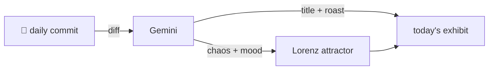

### Hey 👋

I'm Urav. I build things with code.

---

#### 📌 Featured Commit

Every day a bot grabs a commit (one of mine, someone I follow, or a stranger's), an AI names and roasts it, and it ends up as a strange attractor.

<!-- ENTROPY:START -->

### Cues Beyond Color

Chaos ██████░░░░ 65 · Mood $\color{#6FCFB9}{\blacksquare}$ #6FCFB9

[affaan-m/ECC](https://github.com/affaan-m/ECC) by [@tamerbak](https://github.com/tamerbak) · [`2b6e839`](https://github.com/affaan-m/ECC/commit/2b6e839771e53096d8451a213d40dc64ec8acac0)

~~~
Fix/proximity a11y risk cues (#3193)

* fix(control-plane): add non-color airspace risk cues

* test(control-plane): cover airspace accessibility cues
~~~

Ah, finally addressing the accessibility debt of purely color-coded UIs. Adding distinct shapes and a dedicated textual agent list is exactly how it should be done. It's a proper fix, demonstrating a commendable commitment to inclusive design rather than a simple visual tweak. Well played.

captured 2026-09-21

<!-- ENTROPY:END -->

---

What is this?

 

A GitHub Action runs daily and picks a commit: mine if I've pushed recently, otherwise something from my network or a starred repo, and the Linux genesis commit as a last resort. Gemini gives it a name, a roast, a chaos score (0-100), and a mood color. Those become a [Lorenz attractor](https://en.wikipedia.org/wiki/Lorenz_system): chaos controls how wild the butterfly gets, mood tints the gradient, and the commit hash sets the starting point. The math is identical every run, so the commit is the only thing that changes the picture.

[See the code →](./entropy)

