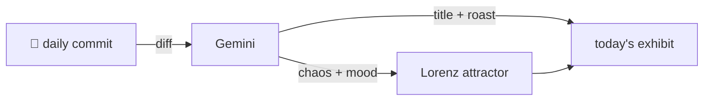

### Hey 👋

I'm Urav. I build things with code.

---

#### 📌 Featured Commit

Every day a bot grabs a commit (one of mine, someone I follow, or a stranger's), an AI names and roasts it, and it ends up as a strange attractor.

<!-- ENTROPY:START -->

### Calibrated Heterogeneity

Chaos ██████░░░░ 65 · Mood $\color{#007FFF}{\blacksquare}$ #007FFF

[murtazahr/Fulcrum](https://github.com/murtazahr/Fulcrum) by [@murtazahr](https://github.com/murtazahr) · [`2a05506`](https://github.com/murtazahr/Fulcrum/commit/2a055060e6bd741548e15ce6b3ee6e578b2fa98f)

~~~
Ground the weight-heterogeneity argument in all seven FLamby federations

The previous version rested on two of FLamby's datasets and on dispersions chosen because
they were the ones already in the code. Table 1 of the benchmark reports per-centre sa
…
~~~

This commit transforms a plausible argument into an ironclad truth. Expanding the analysis to all seven FLamby federations, meticulously detailing their actual heterogeneity, and then calibrating the synthetic evaluation parameters to the *median* real-world distribution, shuts down any pedantic critique of arbitrary choices. A rigorous and thoroughly commendable elevation of evidence.

captured 2026-08-19

<!-- ENTROPY:END -->

---

What is this?

 

A GitHub Action runs daily and picks a commit: mine if I've pushed recently, otherwise something from my network or a starred repo, and the Linux genesis commit as a last resort. Gemini gives it a name, a roast, a chaos score (0-100), and a mood color. Those become a [Lorenz attractor](https://en.wikipedia.org/wiki/Lorenz_system): chaos controls how wild the butterfly gets, mood tints the gradient, and the commit hash sets the starting point. The math is identical every run, so the commit is the only thing that changes the picture.

[See the code →](./entropy)

