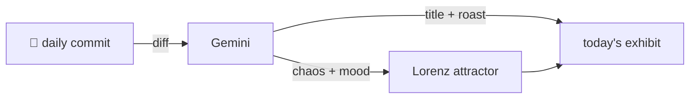

### Hey 👋

I'm Urav. I build things with code.

---

#### 📌 Featured Commit

Every day a bot grabs a commit (one of mine, someone I follow, or a stranger's), an AI names and roasts it, and it ends up as a strange attractor.

<!-- ENTROPY:START -->

### The Perennial Bump

Chaos █░░░░░░░░░ 15 · Mood $\color{#A0CBE8}{\blacksquare}$ #A0CBE8

[github/spec-kit](https://github.com/github/spec-kit) by [@mnriem](https://github.com/mnriem) · [`c47f334`](https://github.com/github/spec-kit/commit/c47f334629bed1394424bafb01e717abdf76b449)

~~~
chore: release 0.8.14, begin 0.8.15.dev0 development (#2706)

* chore: bump version to 0.8.14

* chore: begin 0.8.15.dev0 development

…
~~~

Another glorious cycle completes, with bots co-authoring the inevitable version bump and changelog update. This is a perfectly mechanical 'chore', proving that the wheels of progress, even the tiny ones, keep turning on schedule. The future date in the changelog entry is a delightful touch, ensuring *someone* is always thinking ahead.

captured 2026-05-26

<!-- ENTROPY:END -->

---

What is this?

 

A GitHub Action runs daily and picks a commit: mine if I've pushed recently, otherwise something from my network or a starred repo, and the Linux genesis commit as a last resort. Gemini gives it a name, a roast, a chaos score (0-100), and a mood color. Those become a [Lorenz attractor](https://en.wikipedia.org/wiki/Lorenz_system): chaos controls how wild the butterfly gets, mood tints the gradient, and the commit hash sets the starting point. The math is identical every run, so the commit is the only thing that changes the picture.

[See the code →](./entropy)

