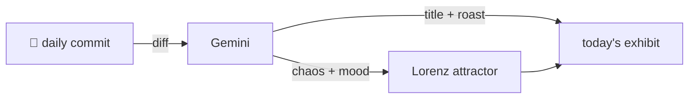

### Hey 👋

I'm Urav. I build things with code.

---

#### 📌 Featured Commit

Every day a bot grabs a commit (one of mine, someone I follow, or a stranger's), an AI names and roasts it, and it ends up as a strange attractor.

<!-- ENTROPY:START -->

### Blueprint For Any Endeavor

Chaos ███░░░░░░░ 35 · Mood $\color{#7FA3B3}{\blacksquare}$ #7FA3B3

[mattpocock/skills](https://github.com/mattpocock/skills) by [@mattpocock](https://github.com/mattpocock) · [`0877403`](https://github.com/mattpocock/skills/commit/0877403d1e867fd9d574117e9b34ade404f36d2a)

~~~
Merge pull request #398 from mattpocock/generalize-decision-mapping

Generalize decision-mapping beyond engineering
~~~

This isn't a trivial change; it's a clever strategic expansion. Elevating a tactical engineering-focused skill into a domain-agnostic meta-skill for any form of project planning significantly boosts its utility. The expanded 'prototype' definition and the new 'notes' block show thoughtful consideration for this broader application.

captured 2026-07-01

<!-- ENTROPY:END -->

---

What is this?

 

A GitHub Action runs daily and picks a commit: mine if I've pushed recently, otherwise something from my network or a starred repo, and the Linux genesis commit as a last resort. Gemini gives it a name, a roast, a chaos score (0-100), and a mood color. Those become a [Lorenz attractor](https://en.wikipedia.org/wiki/Lorenz_system): chaos controls how wild the butterfly gets, mood tints the gradient, and the commit hash sets the starting point. The math is identical every run, so the commit is the only thing that changes the picture.

[See the code →](./entropy)

