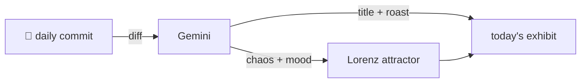

### Hey 👋

I'm Urav. I build things with code.

---

#### 📌 Featured Commit

Every day a bot grabs a commit (one of mine, someone I follow, or a stranger's), an AI names and roasts it, and it ends up as a strange attractor.

<!-- ENTROPY:START -->

### Unified Link Protocol

Chaos ██████░░░░ 60 · Mood $\color{#2196F3}{\blacksquare}$ #2196F3

[palmier-io/palmier-pro](https://github.com/palmier-io/palmier-pro) by [@htin1](https://github.com/htin1) · [`5ba45f4`](https://github.com/palmier-io/palmier-pro/commit/5ba45f48ef51578b40ec94ade3e058fc5853d719)

~~~
[agent] Add clip link management tool (#462)

Expose shared clip link mutations so agents can create J/L cuts without duplicating UI behavior.

Co-authored-by: Cursor <cursoragent@cursor.com>
~~~

This commit nails a classic video editing pain point with surprising grace. By centralizing clip link eligibility logic, it cleverly prevents future UI and agent divergence for critical J-cuts and L-cuts. The thorough description and robust tests show a deep understanding of the problem and a surprisingly clean, reliable solution.

captured 2026-08-02

<!-- ENTROPY:END -->

---

What is this?

 

A GitHub Action runs daily and picks a commit: mine if I've pushed recently, otherwise something from my network or a starred repo, and the Linux genesis commit as a last resort. Gemini gives it a name, a roast, a chaos score (0-100), and a mood color. Those become a [Lorenz attractor](https://en.wikipedia.org/wiki/Lorenz_system): chaos controls how wild the butterfly gets, mood tints the gradient, and the commit hash sets the starting point. The math is identical every run, so the commit is the only thing that changes the picture.

[See the code →](./entropy)

