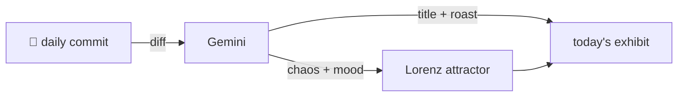

### Hey 👋

I'm Urav. I build things with code.

---

#### 📌 Featured Commit

Every day a bot grabs a commit (one of mine, someone I follow, or a stranger's), an AI names and roasts it, and it ends up as a strange attractor.

<!-- ENTROPY:START -->

### Error States, Unmasked

Chaos ██████░░░░ 65 · Mood $\color{#20B2AA}{\blacksquare}$ #20B2AA

[rid-saw/latent](https://github.com/rid-saw/latent) by [@rid-saw](https://github.com/rid-saw) · [`551d1f2`](https://github.com/rid-saw/latent/commit/551d1f2cf2bace001f5ce9c9047821ffe28cc030)

~~~
feat(frontend): show errors in place, with a way to retry

Wires the recovered error states into the UI. The create modal stays open
on failure and keeps the typed query, so a retry doesn't mean retyping a
prompt that took thought to write. A failed
…
~~~

This is absolutely vital work, transforming 'what happened?' into 'here's what went wrong, and how you can fix it.' Addressing the 'skeletons forever' problem and allowing retries without retyping is just good user experience engineering. Every missing error state is a silent bug, and this commit squashes many.

captured 2026-08-03

<!-- ENTROPY:END -->

---

What is this?

 

A GitHub Action runs daily and picks a commit: mine if I've pushed recently, otherwise something from my network or a starred repo, and the Linux genesis commit as a last resort. Gemini gives it a name, a roast, a chaos score (0-100), and a mood color. Those become a [Lorenz attractor](https://en.wikipedia.org/wiki/Lorenz_system): chaos controls how wild the butterfly gets, mood tints the gradient, and the commit hash sets the starting point. The math is identical every run, so the commit is the only thing that changes the picture.

[See the code →](./entropy)

