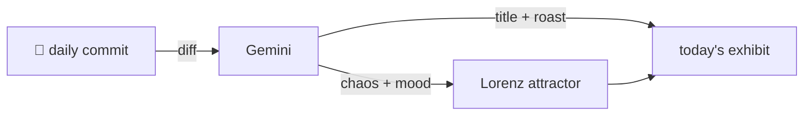

### Hey 👋

I'm Urav. I build things with code.

---

#### 📌 Featured Commit

Every day a bot grabs a commit (one of mine, someone I follow, or a stranger's), an AI names and roasts it, and it ends up as a strange attractor.

<!-- ENTROPY:START -->

### Clutter Conquest Guide

Chaos ░░░░░░░░░░ 7 · Mood $\color{#4281A4}{\blacksquare}$ #4281A4

[urav06/claudestrophobic](https://github.com/urav06/claudestrophobic) by [@urav06](https://github.com/urav06) · [`d6510a0`](https://github.com/urav06/claudestrophobic/commit/d6510a09f8b492c4c6d8eace531501b7ff2747f1)

~~~
docs: tighten README
~~~

This README revision is absolutely vital. It transforms vague descriptions into a sharp, pointed argument for the tool's necessity, clearly articulating a real user pain point that Claude Code has criminally neglected. It's less a documentation tightening and more a declaration of war on AI-driven digital clutter.

captured 2026-06-04

<!-- ENTROPY:END -->

---

What is this?

 

A GitHub Action runs daily and picks a commit: mine if I've pushed recently, otherwise something from my network or a starred repo, and the Linux genesis commit as a last resort. Gemini gives it a name, a roast, a chaos score (0-100), and a mood color. Those become a [Lorenz attractor](https://en.wikipedia.org/wiki/Lorenz_system): chaos controls how wild the butterfly gets, mood tints the gradient, and the commit hash sets the starting point. The math is identical every run, so the commit is the only thing that changes the picture.

[See the code →](./entropy)

