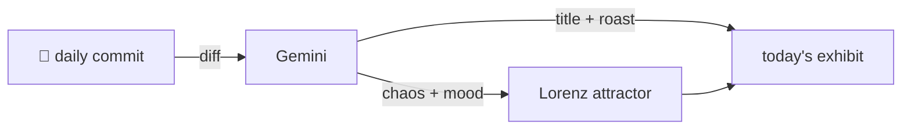

### Hey 👋

I'm Urav. I build things with code.

---

#### 📌 Featured Commit

Every day a bot grabs a commit (one of mine, someone I follow, or a stranger's), an AI names and roasts it, and it ends up as a strange attractor.

<!-- ENTROPY:START -->

### Robust Removal Ritual

Chaos ██████░░░░ 65 · Mood $\color{#2C3E50}{\blacksquare}$ #2C3E50

[urav06/claudestrophobic](https://github.com/urav06/claudestrophobic) by [@urav06](https://github.com/urav06) · [`64a9157`](https://github.com/urav06/claudestrophobic/commit/64a915765a42b07c3f05dff74952cb0742780997)

~~~
fix: confirm deletes only the previewed set; report refused removals (0.4.1)

A `--confirm` re-resolved its selector, so a project that became orphaned
between preview and confirm was deleted unapproved. The preview now pins
the set and confirm refus
…
~~~

This commit is less a fix and more a masterclass in risk mitigation. Pinning delete targets is precisely what prevents `rm -rf /` style oopsies when the filesystem shifts underfoot. And actual user-friendly feedback on *why* the OS said 'no' instead of a cryptic stack trace? Peak pragmatism. Whoever implemented this knows how production systems *actually* behave, which is a rare and glorious thing.

captured 2026-09-24

<!-- ENTROPY:END -->

---

What is this?

 

A GitHub Action runs daily and picks a commit: mine if I've pushed recently, otherwise something from my network or a starred repo, and the Linux genesis commit as a last resort. Gemini gives it a name, a roast, a chaos score (0-100), and a mood color. Those become a [Lorenz attractor](https://en.wikipedia.org/wiki/Lorenz_system): chaos controls how wild the butterfly gets, mood tints the gradient, and the commit hash sets the starting point. The math is identical every run, so the commit is the only thing that changes the picture.

[See the code →](./entropy)

