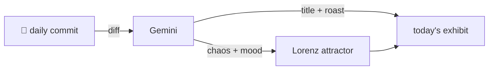

### Hey 👋

I'm Urav. I build things with code.

---

#### 📌 Featured Commit

Every day a bot grabs a commit (one of mine, someone I follow, or a stranger's), an AI names and roasts it, and it ends up as a strange attractor.

<!-- ENTROPY:START -->

### Commitment Clarified

Chaos ░░░░░░░░░░ 5 · Mood $\color{#A7D7E9}{\blacksquare}$ #A7D7E9

[mattpocock/skills](https://github.com/mattpocock/skills) by [@mattpocock](https://github.com/mattpocock) · [`84fdeff`](https://github.com/mattpocock/skills/commit/84fdeffd12f2ee307994d1eb6feb48173b6e0502)

~~~
Merge pull request #788 from mattpocock/grill-me-align

docs(grill-me): drop the "holds decisions" phrasing
~~~

A tiny yet impactful textual adjustment; swapping out passive AI agency for active human commitment clarifies the tool's true purpose. Sometimes the biggest improvements come from reining in language, ensuring the user remains firmly in the driver's seat. Well-played.

captured 2026-08-08

<!-- ENTROPY:END -->

---

What is this?

 

A GitHub Action runs daily and picks a commit: mine if I've pushed recently, otherwise something from my network or a starred repo, and the Linux genesis commit as a last resort. Gemini gives it a name, a roast, a chaos score (0-100), and a mood color. Those become a [Lorenz attractor](https://en.wikipedia.org/wiki/Lorenz_system): chaos controls how wild the butterfly gets, mood tints the gradient, and the commit hash sets the starting point. The math is identical every run, so the commit is the only thing that changes the picture.

[See the code →](./entropy)

