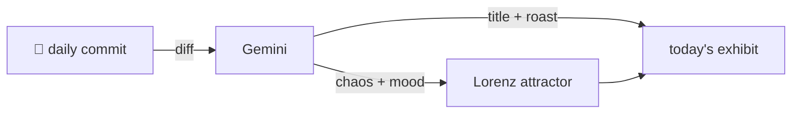

### Hey 👋

I'm Urav. I build things with code.

---

#### 📌 Featured Commit

Every day a bot grabs a commit (one of mine, someone I follow, or a stranger's), an AI names and roasts it, and it ends up as a strange attractor.

<!-- ENTROPY:START -->

### Locale Pruned For Speech

Chaos ██████░░░░ 60 · Mood $\color{#428BCA}{\blacksquare}$ #428BCA

[palmier-io/palmier-pro](https://github.com/palmier-io/palmier-pro) by [@htin1](https://github.com/htin1) · [`669c3d3`](https://github.com/palmier-io/palmier-pro/commit/669c3d3bdc625557fc7859fe85062be8dba09f2c)

~~~
Merge pull request #57 from brianchiruka/fix/locale-unicode-extension-transcription

Fix on-device transcription failing with non-default system region
~~~

Ah, the glorious complexities of Locale and framework interoperability. Someone finally stripped down the BCP 47 identifier to its bare minimum for the notoriously picky Speech framework. It's a frustrating but necessary dance to align rich locale data with system APIs that only understand simpler forms.

captured 2026-07-09

<!-- ENTROPY:END -->

---

What is this?

 

A GitHub Action runs daily and picks a commit: mine if I've pushed recently, otherwise something from my network or a starred repo, and the Linux genesis commit as a last resort. Gemini gives it a name, a roast, a chaos score (0-100), and a mood color. Those become a [Lorenz attractor](https://en.wikipedia.org/wiki/Lorenz_system): chaos controls how wild the butterfly gets, mood tints the gradient, and the commit hash sets the starting point. The math is identical every run, so the commit is the only thing that changes the picture.

[See the code →](./entropy)

