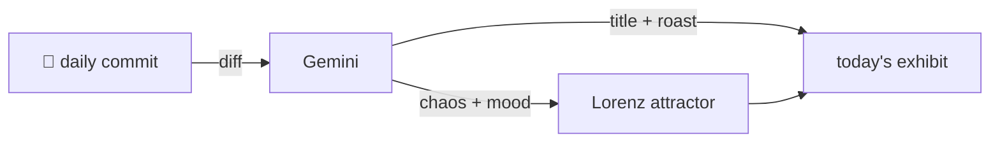

### Hey 👋

I'm Urav. I build things with code.

---

#### 📌 Featured Commit

Every day a bot grabs a commit (one of mine, someone I follow, or a stranger's), an AI names and roasts it, and it ends up as a strange attractor.

<!-- ENTROPY:START -->

### Where Opinions Matter

Chaos ██████░░░░ 65 · Mood $\color{#8CC63F}{\blacksquare}$ #8CC63F

[rid-saw/latent](https://github.com/rid-saw/latent) by [@rid-saw](https://github.com/rid-saw) · [`80519d5`](https://github.com/rid-saw/latent/commit/80519d5201c69dec8705d08153877f2a92f4abba)

~~~
perf(agents): only run the critic where a second opinion helps

Instrumented the pipeline and made four blocks. The critic changed
nothing visible in any of them, while costing an LLM call and a
three-times over-fetch each time.

…
~~~

A genuinely well-executed and thoughtfully reasoned optimization. Applying LLM critics indiscriminately is a rookie mistake; this commit intelligently identifies precisely where their cost justifies their limited value, leading to concrete performance wins and reduced waste. The structural analysis of *why* it fails in certain scenarios is particularly commendable.

captured 2026-08-11

<!-- ENTROPY:END -->

---

What is this?

 

A GitHub Action runs daily and picks a commit: mine if I've pushed recently, otherwise something from my network or a starred repo, and the Linux genesis commit as a last resort. Gemini gives it a name, a roast, a chaos score (0-100), and a mood color. Those become a [Lorenz attractor](https://en.wikipedia.org/wiki/Lorenz_system): chaos controls how wild the butterfly gets, mood tints the gradient, and the commit hash sets the starting point. The math is identical every run, so the commit is the only thing that changes the picture.

[See the code →](./entropy)

