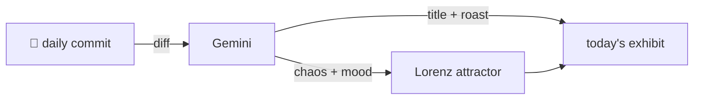

### Hey 👋

I'm Urav. I build things with code.

---

#### 📌 Featured Commit

Every day a bot grabs a commit (one of mine, someone I follow, or a stranger's), an AI names and roasts it, and it ends up as a strange attractor.

<!-- ENTROPY:START -->

### Truth From The Wires

Chaos ██░░░░░░░░ 25 · Mood $\color{#2A3C4D}{\blacksquare}$ #2A3C4D

[murtazahr/Kafila](https://github.com/murtazahr/Kafila) by [@murtazahr](https://github.com/murtazahr) · [`4e39eb0`](https://github.com/murtazahr/Kafila/commit/4e39eb0c514fb175d32007d2c13e121464fcb90a)

~~~
research: design brief for the operations dashboard

A prompt to hand a design tool, grounded in the system's real data rather
than invented shapes: the topology JSON, both trace line types, and the
measured numbers from a running three-node cluster.
…
~~~

This isn't just a design brief; it's a meticulously engineered spec for observability, deeply aware of its system's realities. It surgically dissects common pitfalls, particularly around timing and misleading metrics, by grounding every constraint in concrete data and distributed systems principles. The insistence on avoiding invented data and distinguishing real flight time from round-trip time is brilliant, demonstrating profound foresight.

captured 2026-08-15

<!-- ENTROPY:END -->

---

What is this?

 

A GitHub Action runs daily and picks a commit: mine if I've pushed recently, otherwise something from my network or a starred repo, and the Linux genesis commit as a last resort. Gemini gives it a name, a roast, a chaos score (0-100), and a mood color. Those become a [Lorenz attractor](https://en.wikipedia.org/wiki/Lorenz_system): chaos controls how wild the butterfly gets, mood tints the gradient, and the commit hash sets the starting point. The math is identical every run, so the commit is the only thing that changes the picture.

[See the code →](./entropy)

