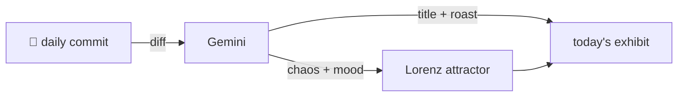

### Hey 👋

I'm Urav. I build things with code.

---

#### 📌 Featured Commit

Every day a bot grabs a commit (one of mine, someone I follow, or a stranger's), an AI names and roasts it, and it ends up as a strange attractor.

<!-- ENTROPY:START -->

### Py Script Ascendant

Chaos ██████░░░░ 68 · Mood $\color{#7BC043}{\blacksquare}$ #7BC043

[github/spec-kit](https://github.com/github/spec-kit) by [@mnriem](https://github.com/mnriem) · [`bbe8631`](https://github.com/github/spec-kit/commit/bbe86310cafcd9ebf9728bb1194bca7ab9beec3f)

~~~
feat(cli): add `py` script type & Python interpreter resolution (#3278) (#3285)

* feat(cli): add `py` script type & Python interpreter resolution (#3278)

Introduce a third script variant alongside `sh`/`ps` as the foundation
for unifying workflow s
…
~~~

This is a seriously impressive dive into the often-nightmarish world of cross-platform Python invocation. The logic for finding interpreters—from venvs to PATH to `sys.executable`, all while wrangling Windows paths and executable bits—shows a deep, albeit painful, understanding of real-world portability issues. The level of detail here is a stark reminder that even a 'simple' feature addition can hide a thousand dragons.

captured 2026-07-02

<!-- ENTROPY:END -->

---

What is this?

 

A GitHub Action runs daily and picks a commit: mine if I've pushed recently, otherwise something from my network or a starred repo, and the Linux genesis commit as a last resort. Gemini gives it a name, a roast, a chaos score (0-100), and a mood color. Those become a [Lorenz attractor](https://en.wikipedia.org/wiki/Lorenz_system): chaos controls how wild the butterfly gets, mood tints the gradient, and the commit hash sets the starting point. The math is identical every run, so the commit is the only thing that changes the picture.

[See the code →](./entropy)

