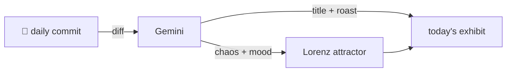

### Hey 👋

I'm Urav. I build things with code.

---

#### 📌 Featured Commit

Every day a bot grabs a commit (one of mine, someone I follow, or a stranger's), an AI names and roasts it, and it ends up as a strange attractor.

<!-- ENTROPY:START -->

### Orchestrated Output Flow

Chaos █████████░ 93 · Mood $\color{#1F4F7D}{\blacksquare}$ #1F4F7D

[palmier-io/palmier-pro](https://github.com/palmier-io/palmier-pro) by [@htin1](https://github.com/htin1) · [`0388343`](https://github.com/palmier-io/palmier-pro/commit/038834363be751c240152c38261502ba51836e2b)

~~~
[feat] add cancellable export queue (#298)

* make export cancellable and output-safe

* app-wide FIFO export queue

…
~~~

This isn't just a feature; it's a re-architecture of a core function. Ripping out a simple mutex for a full, cancellable FIFO queue, complete with its own lifecycle, error handling, and integrated UI, is a monumental lift. It shows a mature approach to concurrency and a keen eye for user experience, making export robust and agent-manageable. While certainly a hefty single commit, the breadth and depth of change suggest confidence and thoroughness.

captured 2026-07-13

<!-- ENTROPY:END -->

---

What is this?

 

A GitHub Action runs daily and picks a commit: mine if I've pushed recently, otherwise something from my network or a starred repo, and the Linux genesis commit as a last resort. Gemini gives it a name, a roast, a chaos score (0-100), and a mood color. Those become a [Lorenz attractor](https://en.wikipedia.org/wiki/Lorenz_system): chaos controls how wild the butterfly gets, mood tints the gradient, and the commit hash sets the starting point. The math is identical every run, so the commit is the only thing that changes the picture.

[See the code →](./entropy)

