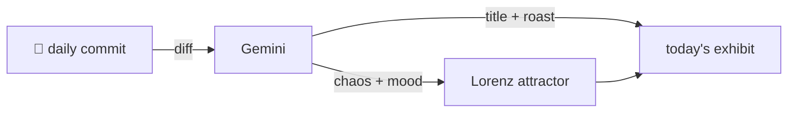

### Hey 👋

I'm Urav. I build things with code.

---

#### 📌 Featured Commit

Every day a bot grabs a commit (one of mine, someone I follow, or a stranger's), an AI names and roasts it, and it ends up as a strange attractor.

<!-- ENTROPY:START -->

### Vault Trauma Mended

Chaos █████░░░░░ 55 · Mood $\color{#4A90E2}{\blacksquare}$ #4A90E2

[affaan-m/ECC](https://github.com/affaan-m/ECC) by [@affaan-m](https://github.com/affaan-m) · [`8321021`](https://github.com/affaan-m/ECC/commit/8321021c54d670126ce3b2969d5deb880b4b0c2a)

~~~
fix(memory): classify directory traversal failures
~~~

Centralizing that 'incomplete' error is a smart move for system robustness and error clarity. The lengths gone to in the tests, however, simulating every potential directory traversal failure, speaks volumes about past traumas. Sometimes you just have to assume `fs` won't self-destruct mid-read, but in a 'memory vault', this meticulousness might be just what's needed.

captured 2026-09-15

<!-- ENTROPY:END -->

---

What is this?

 

A GitHub Action runs daily and picks a commit: mine if I've pushed recently, otherwise something from my network or a starred repo, and the Linux genesis commit as a last resort. Gemini gives it a name, a roast, a chaos score (0-100), and a mood color. Those become a [Lorenz attractor](https://en.wikipedia.org/wiki/Lorenz_system): chaos controls how wild the butterfly gets, mood tints the gradient, and the commit hash sets the starting point. The math is identical every run, so the commit is the only thing that changes the picture.

[See the code →](./entropy)

