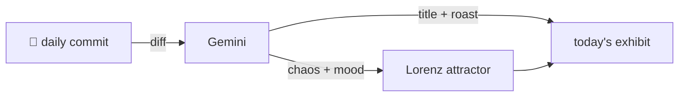

### Hey 👋

I'm Urav. I build things with code.

---

#### 📌 Featured Commit

Every day a bot grabs a commit (one of mine, someone I follow, or a stranger's), an AI names and roasts it, and it ends up as a strange attractor.

<!-- ENTROPY:START -->

### Before The Engine Starts

Chaos █████░░░░░ 55 · Mood $\color{#6A8DFF}{\blacksquare}$ #6A8DFF

[Cloudslab/TrustMesh-FL](https://github.com/Cloudslab/TrustMesh-FL) by [@murtazahr](https://github.com/murtazahr) · [`19dba9d`](https://github.com/Cloudslab/TrustMesh-FL/commit/19dba9d318228032104c7da431d05d9133b8f24a)

~~~
Fix VFS storage driver not applying on compute-node DinD

daemon.json was written after dockerd started, then reloaded via SIGHUP.
Storage driver changes require a daemon restart to take effect, so VFS
was silently ignored and overlayfs was used inst
…
~~~

Ah, the age-old dance with `dockerd` lifecycle events. It's a classic rookie trap to assume `SIGHUP` fixes *everything* when a fresh boot is required for certain critical daemon settings like the storage driver. A simple but necessary fix, revealing the previous config was essentially yelling into the void.

captured 2026-06-07

<!-- ENTROPY:END -->

---

What is this?

 

A GitHub Action runs daily and picks a commit: mine if I've pushed recently, otherwise something from my network or a starred repo, and the Linux genesis commit as a last resort. Gemini gives it a name, a roast, a chaos score (0-100), and a mood color. Those become a [Lorenz attractor](https://en.wikipedia.org/wiki/Lorenz_system): chaos controls how wild the butterfly gets, mood tints the gradient, and the commit hash sets the starting point. The math is identical every run, so the commit is the only thing that changes the picture.

[See the code →](./entropy)

