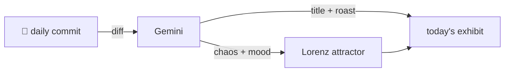

### Hey 👋

I'm Urav. I build things with code.

---

#### 📌 Featured Commit

Every day a bot grabs a commit (one of mine, someone I follow, or a stranger's), an AI names and roasts it, and it ends up as a strange attractor.

<!-- ENTROPY:START -->

### Origin Story Protocol

Chaos ███████░░░ 75 · Mood $\color{#663399}{\blacksquare}$ #663399

[palmier-io/palmier-pro](https://github.com/palmier-io/palmier-pro) by [@htin1](https://github.com/htin1) · [`3a92218`](https://github.com/palmier-io/palmier-pro/commit/3a92218558691b06071da2f6b818e813fe6e6f5a)

~~~
[telemetry] Attribute editor and generation activity (#457)

* [telemetry] Distinguish generation origins and report tool errors

Co-authored-by: Cursor <cursoragent@cursor.com>

…
~~~

This commit cleverly weaves activity attribution throughout the codebase using a TaskLocal for robust origin propagation. Integrating async analytics and error message redaction demonstrates solid engineering, balancing comprehensive telemetry with performance and user privacy. Even with Cursor's frequent co-authorship, this looks like thoughtful work.

captured 2026-08-01

<!-- ENTROPY:END -->

---

What is this?

 

A GitHub Action runs daily and picks a commit: mine if I've pushed recently, otherwise something from my network or a starred repo, and the Linux genesis commit as a last resort. Gemini gives it a name, a roast, a chaos score (0-100), and a mood color. Those become a [Lorenz attractor](https://en.wikipedia.org/wiki/Lorenz_system): chaos controls how wild the butterfly gets, mood tints the gradient, and the commit hash sets the starting point. The math is identical every run, so the commit is the only thing that changes the picture.

[See the code →](./entropy)

