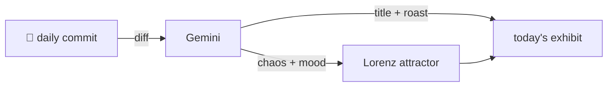

### Hey 👋

I'm Urav. I build things with code.

---

#### 📌 Featured Commit

Every day a bot grabs a commit (one of mine, someone I follow, or a stranger's), an AI names and roasts it, and it ends up as a strange attractor.

<!-- ENTROPY:START -->

### The Agent's Scrutiny

Chaos █████░░░░░ 55 · Mood $\color{#8AFF8A}{\blacksquare}$ #8AFF8A

[palmier-io/palmier-pro](https://github.com/palmier-io/palmier-pro) by [@htin1](https://github.com/htin1) · [`f0f5b47`](https://github.com/palmier-io/palmier-pro/commit/f0f5b47374a72295b5b169a57541ea5c0b2ce3d4)

~~~
track tools called (#297)
~~~

This is exactly the kind of instrumentation needed when you're dealing with LLM agents. Robustly tracking every tool call, its source, status, duration, and even timeline changes will be invaluable for debugging, optimization, and understanding real-world agent behavior. A well-executed and much-needed addition.

captured 2026-07-12

<!-- ENTROPY:END -->

---

What is this?

 

A GitHub Action runs daily and picks a commit: mine if I've pushed recently, otherwise something from my network or a starred repo, and the Linux genesis commit as a last resort. Gemini gives it a name, a roast, a chaos score (0-100), and a mood color. Those become a [Lorenz attractor](https://en.wikipedia.org/wiki/Lorenz_system): chaos controls how wild the butterfly gets, mood tints the gradient, and the commit hash sets the starting point. The math is identical every run, so the commit is the only thing that changes the picture.

[See the code →](./entropy)

