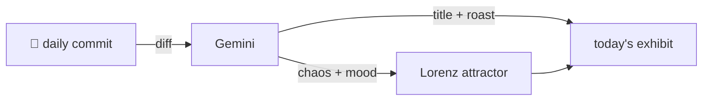

### Hey 👋

I'm Urav. I build things with code.

---

#### 📌 Featured Commit

Every day a bot grabs a commit (one of mine, someone I follow, or a stranger's), an AI names and roasts it, and it ends up as a strange attractor.

<!-- ENTROPY:START -->

### The Upscaler's Brains

Chaos ████████░░ 88 · Mood $\color{#4682B4}{\blacksquare}$ #4682B4

[palmier-io/palmier-pro](https://github.com/palmier-io/palmier-pro) by [@htin1](https://github.com/htin1) · [`94c064c`](https://github.com/palmier-io/palmier-pro/commit/94c064cc918e14e0d08cd1aff6d9b19c1d960865)

~~~
[upscale + ui] more upscale options, and generation panel ui minor change (#396)

* Add configurable upscale generation

* Hide prompts for source-only audio

…
~~~

This isn't just an update; it's an architectural maturation, transforming a basic upscale feature into a configurable, agent-driven powerhouse. The depth of exposing model settings, dynamically adjusting pricing, and performing source-aware validation is both elegant and strategically clever. Axing the entire rerun file, then folding its capabilities into a new, flexible system is a bold, almost audacious refactor.

captured 2026-07-23

<!-- ENTROPY:END -->

---

What is this?

 

A GitHub Action runs daily and picks a commit: mine if I've pushed recently, otherwise something from my network or a starred repo, and the Linux genesis commit as a last resort. Gemini gives it a name, a roast, a chaos score (0-100), and a mood color. Those become a [Lorenz attractor](https://en.wikipedia.org/wiki/Lorenz_system): chaos controls how wild the butterfly gets, mood tints the gradient, and the commit hash sets the starting point. The math is identical every run, so the commit is the only thing that changes the picture.

[See the code →](./entropy)

