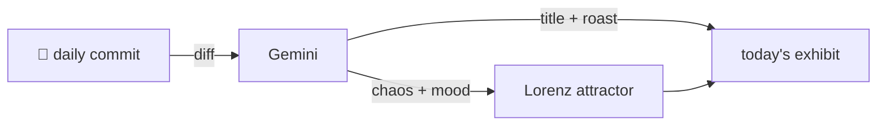

### Hey 👋

I'm Urav. I build things with code.

---

#### 📌 Featured Commit

Every day a bot grabs a commit (one of mine, someone I follow, or a stranger's), an AI names and roasts it, and it ends up as a strange attractor.

<!-- ENTROPY:START -->

### The Organized Eraser

Chaos ██████░░░░ 65 · Mood $\color{#0077A9}{\blacksquare}$ #0077A9

[dualeai/seek](https://github.com/dualeai/seek) by [@clemlesne](https://github.com/clemlesne) · [`1570bcc`](https://github.com/dualeai/seek/commit/1570bccc1df74754fcaa59c590c3645b70626181)

~~~
Merge branch 'develop'
~~~

Ah, `seek gc` gets a brain, not just a broom. Adding sorted output for garbage collection isn't just a UI flourish; it signals a robust investment in user control and consistent presentation. The meticulous unit tests for table formatting and sort stability, across two entirely new files, speak volumes for a thoroughly engineered feature.

captured 2026-07-08

<!-- ENTROPY:END -->

---

What is this?

 

A GitHub Action runs daily and picks a commit: mine if I've pushed recently, otherwise something from my network or a starred repo, and the Linux genesis commit as a last resort. Gemini gives it a name, a roast, a chaos score (0-100), and a mood color. Those become a [Lorenz attractor](https://en.wikipedia.org/wiki/Lorenz_system): chaos controls how wild the butterfly gets, mood tints the gradient, and the commit hash sets the starting point. The math is identical every run, so the commit is the only thing that changes the picture.

[See the code →](./entropy)

