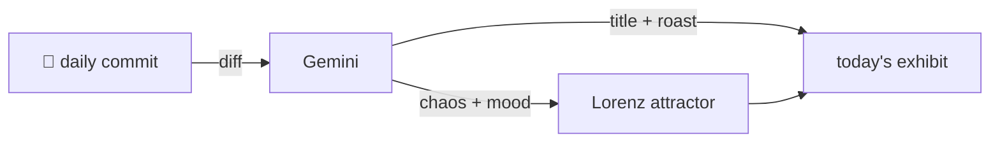

### Hey 👋

I'm Urav. I build things with code.

---

#### 📌 Featured Commit

Every day a bot grabs a commit (one of mine, someone I follow, or a stranger's), an AI names and roasts it, and it ends up as a strange attractor.

<!-- ENTROPY:START -->

### Order From Hook Chaos

Chaos ███████░░░ 75 · Mood $\color{#20B2AA}{\blacksquare}$ #20B2AA

[affaan-m/ECC](https://github.com/affaan-m/ECC) by [@pythonstrup](https://github.com/pythonstrup) · [`0071fa5`](https://github.com/affaan-m/ECC/commit/0071fa5c3c389d2b4b235a39402c891e146cdef3)

~~~
refactor(hooks): consolidate PostToolUse hooks into sync/async dispatchers (#2494)

* refactor(hooks): consolidate PostToolUse hooks into sync/async dispatchers

Replace 10 individual PostToolUse entries in hooks.json with two
consolidated dispatcher
…
~~~

A masterful consolidation, wrestling a dozen unwieldy `PostToolUse` entries into two elegant dispatchers. The performance gains alone are commendable, but the real genius is maintaining feature parity (profiling, disabled flags) and even cleaning up the inline Node resolver nonsense. This commit banishes copy-pasted cruft and brings sanity to the post-execution landscape.

captured 2026-07-20

<!-- ENTROPY:END -->

---

What is this?

 

A GitHub Action runs daily and picks a commit: mine if I've pushed recently, otherwise something from my network or a starred repo, and the Linux genesis commit as a last resort. Gemini gives it a name, a roast, a chaos score (0-100), and a mood color. Those become a [Lorenz attractor](https://en.wikipedia.org/wiki/Lorenz_system): chaos controls how wild the butterfly gets, mood tints the gradient, and the commit hash sets the starting point. The math is identical every run, so the commit is the only thing that changes the picture.

[See the code →](./entropy)

