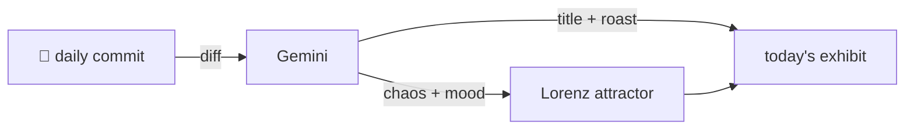

### Hey 👋

I'm Urav. I build things with code.

---

#### 📌 Featured Commit

Every day a bot grabs a commit (one of mine, someone I follow, or a stranger's), an AI names and roasts it, and it ends up as a strange attractor.

<!-- ENTROPY:START -->

### The Hook Signal Standard

Chaos ██████░░░░ 65 · Mood $\color{#61A4BD}{\blacksquare}$ #61A4BD

[affaan-m/ECC](https://github.com/affaan-m/ECC) by [@affaan-m](https://github.com/affaan-m) · [`64cd1ba`](https://github.com/affaan-m/ECC/commit/64cd1ba248e77e377e76f70fc4e6434bfdddd511)

~~~
fix: surface warn-only PreToolUse hooks (#2084)
~~~

This is a brilliant architectural decision, moving 'warn-only' output from the chaotic mess of stderr to structured JSON on stdout. It untangles the output streams beautifully, making programmatic consumption of hook warnings reliable and clear. Centralizing this output mechanism with `pretooluse-visible-output` is pure genius; it feels like untangling a particularly stubborn knot with surgical precision.

captured 2026-05-31

<!-- ENTROPY:END -->

---

What is this?

 

A GitHub Action runs daily and picks a commit: mine if I've pushed recently, otherwise something from my network or a starred repo, and the Linux genesis commit as a last resort. Gemini gives it a name, a roast, a chaos score (0-100), and a mood color. Those become a [Lorenz attractor](https://en.wikipedia.org/wiki/Lorenz_system): chaos controls how wild the butterfly gets, mood tints the gradient, and the commit hash sets the starting point. The math is identical every run, so the commit is the only thing that changes the picture.

[See the code →](./entropy)

