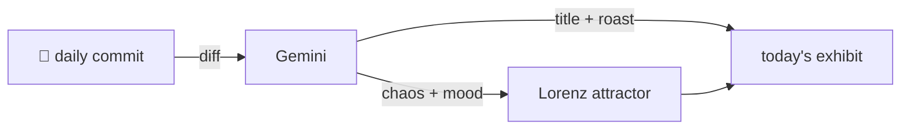

### Hey 👋

I'm Urav. I build things with code.

---

#### 📌 Featured Commit

Every day a bot grabs a commit (one of mine, someone I follow, or a stranger's), an AI names and roasts it, and it ends up as a strange attractor.

<!-- ENTROPY:START -->

### Cache Flow Unimpeded

Chaos ██████░░░░ 65 · Mood $\color{#7DADD0}{\blacksquare}$ #7DADD0

[palmier-io/palmier-pro](https://github.com/palmier-io/palmier-pro) by [@htin1](https://github.com/htin1) · [`cf41b37`](https://github.com/palmier-io/palmier-pro/commit/cf41b373111acf32deffabb2ffdf5923c36a6e4b)

~~~
[fix] Prevent beat-cache hydration hangs (#355)

* [fix] Prevent beat-cache hydration hangs

* [fix] Revalidate beat hydration after URL changes
~~~

Solid concurrency management for a tricky caching problem. The team correctly identified the pitfalls of blocking cache hydration, implemented robust task cancellation, and added clever URL revalidation to ensure stale data doesn't persist. Excellent testing to back it all up; a genuinely thoughtful fix.

captured 2026-07-19

<!-- ENTROPY:END -->

---

What is this?

 

A GitHub Action runs daily and picks a commit: mine if I've pushed recently, otherwise something from my network or a starred repo, and the Linux genesis commit as a last resort. Gemini gives it a name, a roast, a chaos score (0-100), and a mood color. Those become a [Lorenz attractor](https://en.wikipedia.org/wiki/Lorenz_system): chaos controls how wild the butterfly gets, mood tints the gradient, and the commit hash sets the starting point. The math is identical every run, so the commit is the only thing that changes the picture.

[See the code →](./entropy)

