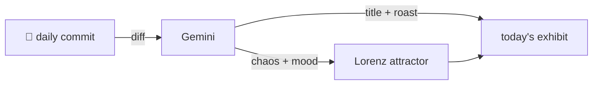

### Hey 👋

I'm Urav. I build things with code.

---

#### 📌 Featured Commit

Every day a bot grabs a commit (one of mine, someone I follow, or a stranger's), an AI names and roasts it, and it ends up as a strange attractor.

<!-- ENTROPY:START -->

### Unified Tool Theory

Chaos █████████░ 95 · Mood $\color{#3D5A80}{\blacksquare}$ #3D5A80

[palmier-io/palmier-pro](https://github.com/palmier-io/palmier-pro) by [@htin1](https://github.com/htin1) · [`c55a5fd`](https://github.com/palmier-io/palmier-pro/commit/c55a5fd382b71eb712aa092ba5603d34607d6d30)

~~~
[agent] rework tools (#263)

* refactor(agent): consolidate library tools — folders by path, organize_media

Reshape the project/media/folder/timeline tool tier (16 tools -> 8):

…
~~~

Genius, but intense. This isn't just a refactor; it's a wholesale architectural re-platforming for the agent. Consolidating multiple tools, introducing path-based folders, and implementing a mutation envelope to update agent state with surgical precision fundamentally improves efficiency and consistency.

captured 2026-07-06

<!-- ENTROPY:END -->

---

What is this?

 

A GitHub Action runs daily and picks a commit: mine if I've pushed recently, otherwise something from my network or a starred repo, and the Linux genesis commit as a last resort. Gemini gives it a name, a roast, a chaos score (0-100), and a mood color. Those become a [Lorenz attractor](https://en.wikipedia.org/wiki/Lorenz_system): chaos controls how wild the butterfly gets, mood tints the gradient, and the commit hash sets the starting point. The math is identical every run, so the commit is the only thing that changes the picture.

[See the code →](./entropy)

