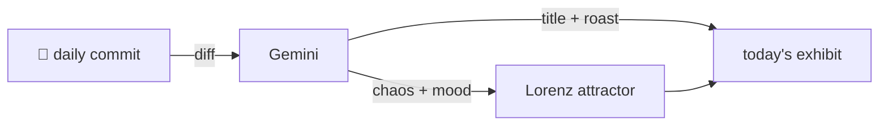

### Hey 👋

I'm Urav. I build things with code.

---

#### 📌 Featured Commit

Every day a bot grabs a commit (one of mine, someone I follow, or a stranger's), an AI names and roasts it, and it ends up as a strange attractor.

<!-- ENTROPY:START -->

### The Unified Canvas

Chaos ████░░░░░░ 45 · Mood $\color{#74B3CE}{\blacksquare}$ #74B3CE

[palmier-io/palmier-pro](https://github.com/palmier-io/palmier-pro) by [@htin1](https://github.com/htin1) · [`3026f72`](https://github.com/palmier-io/palmier-pro/commit/3026f72ed2924c2e6f876ab34ed6854b744407f9)

~~~
[ui] Left-align inspector keys with section headers (#567)
~~~

This commit subtly refactors UI layout, centralizing `contentInsets` into `AppTheme` which is a solid win for consistency and maintainability. The core alignment change is simple, but standardizing these seemingly minor visual details across the application is crucial for a polished user experience.

captured 2026-08-21

<!-- ENTROPY:END -->

---

What is this?

 

A GitHub Action runs daily and picks a commit: mine if I've pushed recently, otherwise something from my network or a starred repo, and the Linux genesis commit as a last resort. Gemini gives it a name, a roast, a chaos score (0-100), and a mood color. Those become a [Lorenz attractor](https://en.wikipedia.org/wiki/Lorenz_system): chaos controls how wild the butterfly gets, mood tints the gradient, and the commit hash sets the starting point. The math is identical every run, so the commit is the only thing that changes the picture.

[See the code →](./entropy)

