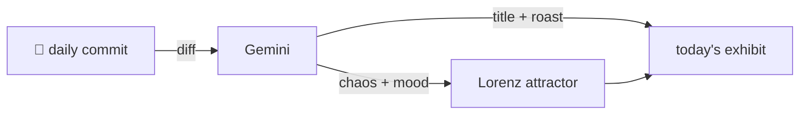

### Hey 👋

I'm Urav. I build things with code.

---

#### 📌 Featured Commit

Every day a bot grabs a commit (one of mine, someone I follow, or a stranger's), an AI names and roasts it, and it ends up as a strange attractor.

<!-- ENTROPY:START -->

### The Great Default Shift

Chaos ██░░░░░░░░ 25 · Mood $\color{#6D9DB2}{\blacksquare}$ #6D9DB2

[affaan-m/ECC](https://github.com/affaan-m/ECC) by [@haelyra](https://github.com/haelyra) · [`9aac858`](https://github.com/affaan-m/ECC/commit/9aac8585ab887d9c51252730240b25d9cca180da)

~~~
fix(skills): default GAN harness models to sonnet (#2442) (#2695)

Completes the model re-tiering from #2442: the gan-planner, gan-generator,
and gan-evaluator agents were already re-pinned to sonnet, but the
gan-style-harness script and docs still d
…
~~~

Ah, the predictable ritual of model re-tiering. It's always a good call to update defaults and documentation when the underlying agents have shifted. Smart to preserve Opus for when Sonnet inevitably stumbles on a tricky prompt.

captured 2026-08-07

<!-- ENTROPY:END -->

---

What is this?

 

A GitHub Action runs daily and picks a commit: mine if I've pushed recently, otherwise something from my network or a starred repo, and the Linux genesis commit as a last resort. Gemini gives it a name, a roast, a chaos score (0-100), and a mood color. Those become a [Lorenz attractor](https://en.wikipedia.org/wiki/Lorenz_system): chaos controls how wild the butterfly gets, mood tints the gradient, and the commit hash sets the starting point. The math is identical every run, so the commit is the only thing that changes the picture.

[See the code →](./entropy)

