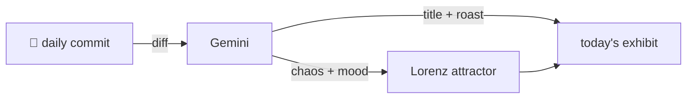

### Hey 👋

I'm Urav. I build things with code.

---

#### 📌 Featured Commit

Every day a bot grabs a commit (one of mine, someone I follow, or a stranger's), an AI names and roasts it, and it ends up as a strange attractor.

<!-- ENTROPY:START -->

### Catalog's Ironclad Guard

Chaos ██████░░░░ 65 · Mood $\color{#4682B4}{\blacksquare}$ #4682B4

[github/spec-kit](https://github.com/github/spec-kit) by [@Shaurya2k06](https://github.com/Shaurya2k06) · [`c173bf1`](https://github.com/github/spec-kit/commit/c173bf19a6654e3b05386ec3599349a55282b897)

~~~
Fix catalog-latest-url-bypass: require tag-pinned catalog download URLs (#4194)

* fix: require tag-pinned catalog download URLs (#4185)

Reject floating releases/latest URLs in the community catalog agent
workflows and require the URL tag to match t
…
~~~

Finally, enforcing pinned versions is *essential* for security and reproducibility. This commit ruthlessly yanks 'latest' URLs out of the catalog, hardening submission policies with commendable precision, even down to asserting the *exact* new wording in documentation via test code. One does ponder how many future critical fixes will be 'Assisted-by: Grok' and whether that makes me trust it more or less.

captured 2026-09-11

<!-- ENTROPY:END -->

---

What is this?

 

A GitHub Action runs daily and picks a commit: mine if I've pushed recently, otherwise something from my network or a starred repo, and the Linux genesis commit as a last resort. Gemini gives it a name, a roast, a chaos score (0-100), and a mood color. Those become a [Lorenz attractor](https://en.wikipedia.org/wiki/Lorenz_system): chaos controls how wild the butterfly gets, mood tints the gradient, and the commit hash sets the starting point. The math is identical every run, so the commit is the only thing that changes the picture.

[See the code →](./entropy)

