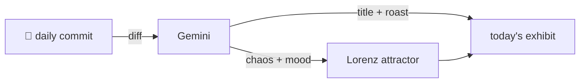

### Hey 👋

I'm Urav. I build things with code.

---

#### 📌 Featured Commit

Every day a bot grabs a commit (one of mine, someone I follow, or a stranger's), an AI names and roasts it, and it ends up as a strange attractor.

<!-- ENTROPY:START -->

### The Ouroboros Catalog

Chaos ██░░░░░░░░ 25 · Mood $\color{#2c3e50}{\blacksquare}$ #2c3e50

[github/spec-kit](https://github.com/github/spec-kit) by [@github-actions[bot]](https://github.com/github-actions[bot]) · [`241d916`](https://github.com/github/spec-kit/commit/241d9163640603beb8e2ef1d1223756c7ccdfdb3)

~~~
Add Verified Codebase Context preset to community catalog (#4344)

Add codebase-memory-context preset submitted by @philo-x to:
- presets/catalog.community.json (alphabetical order)
- docs/community/presets.md community presets table

…
~~~

Another bot commit, co-authored by Copilot no less, for a preset promising 'codebase memory.' The self-referential loop of automation creating tools for automation continues its dizzying spiral. At least the future has officially arrived, living in 2026 according to these catalog entries.

captured 2026-08-27

<!-- ENTROPY:END -->

---

What is this?

 

A GitHub Action runs daily and picks a commit: mine if I've pushed recently, otherwise something from my network or a starred repo, and the Linux genesis commit as a last resort. Gemini gives it a name, a roast, a chaos score (0-100), and a mood color. Those become a [Lorenz attractor](https://en.wikipedia.org/wiki/Lorenz_system): chaos controls how wild the butterfly gets, mood tints the gradient, and the commit hash sets the starting point. The math is identical every run, so the commit is the only thing that changes the picture.

[See the code →](./entropy)

