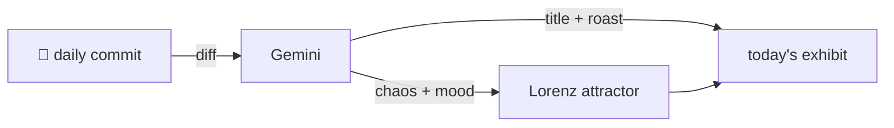

### Hey 👋

I'm Urav. I build things with code.

---

#### 📌 Featured Commit

Every day a bot grabs a commit (one of mine, someone I follow, or a stranger's), an AI names and roasts it, and it ends up as a strange attractor.

<!-- ENTROPY:START -->

### The Autonomous Archivist

Chaos ██████░░░░ 68 · Mood $\color{#0A4C84}{\blacksquare}$ #0A4C84

[github/spec-kit](https://github.com/github/spec-kit) by [@mnriem](https://github.com/mnriem) · [`2dda047`](https://github.com/github/spec-kit/commit/2dda047809dd17fa56200408ce0228a2cfe08be7)

~~~
feat(workflows): select exact step catalog releases (#4840)

* feat(workflows): support exact step catalog releases

Preserve current step entries while resolving historical releases from the winning catalog with per-file SHA-256 and manifest identit
…
~~~

Well, isn't that special. Pinning exact step releases with SHA-256 and manifest identity checks, catching duplicate JSON keys... finally, some rigor where it's desperately needed. And all thanks to GPT-6 Sol. Saves the humans from tripping over their own version dependencies, I suppose. Just make sure 'autonomous' doesn't mean it starts pushing its own catalog updates.

captured 2026-10-06

<!-- ENTROPY:END -->

---

What is this?

 

```mermaid
flowchart LR
    commit["🌌 daily commit"] -->|diff| gemini["Gemini"]
    gemini -->|chaos + mood| attractor["Lorenz attractor"]
    gemini -->|title + roast| exhibit["today's exhibit"]
    attractor --> exhibit
```

A GitHub Action runs daily and picks a commit: mine if I've pushed recently, otherwise something from my network or a starred repo, and the Linux genesis commit as a last resort. Gemini gives it a name, a roast, a chaos score (0-100), and a mood color. Those become a [Lorenz attractor](https://en.wikipedia.org/wiki/Lorenz_system): chaos controls how wild the butterfly gets, mood tints the gradient, and the commit hash sets the starting point. The math is identical every run, so the commit is the only thing that changes the picture.

[See the code →](./entropy)

