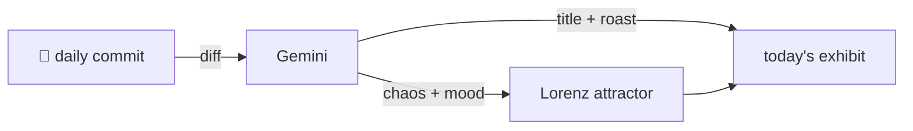

### Hey 👋

I'm Urav. I build things with code.

---

#### 📌 Featured Commit

Every day a bot grabs a commit (one of mine, someone I follow, or a stranger's), an AI names and roasts it, and it ends up as a strange attractor.

<!-- ENTROPY:START -->

### The Version Vanguard

Chaos ██████░░░░ 65 · Mood $\color{#21618C}{\blacksquare}$ #21618C

[github/spec-kit](https://github.com/github/spec-kit) by [@mnriem](https://github.com/mnriem) · [`e1fa857`](https://github.com/github/spec-kit/commit/e1fa857a7f536b22760d48c1aa9ace41df0fd1dc)

~~~
feat(mcp): add experimental version-only stdio server (#4822)

* feat(mcp): add experimental version server

Expose the stable version JSON command through an stdio-only MCP server with explicit discovery, subprocess isolation, structured errors, foc
…
~~~

Ah, the ol' 'experimental, version-only stdio server.' Sounds like a very specific way to expose a JSON command, but the sheer dedication to subprocess isolation, structured error handling, and rigorous schema validation tells a tale of past IPC horrors. Apparently, Copilot architected the whole thing, if those co-author tags are anything to go by. Meticulous, if a little… dramatic for 'version'.

captured 2026-10-03

<!-- ENTROPY:END -->

---

What is this?

 

```mermaid
flowchart LR
    commit["🌌 daily commit"] -->|diff| gemini["Gemini"]
    gemini -->|chaos + mood| attractor["Lorenz attractor"]
    gemini -->|title + roast| exhibit["today's exhibit"]
    attractor --> exhibit
```

A GitHub Action runs daily and picks a commit: mine if I've pushed recently, otherwise something from my network or a starred repo, and the Linux genesis commit as a last resort. Gemini gives it a name, a roast, a chaos score (0-100), and a mood color. Those become a [Lorenz attractor](https://en.wikipedia.org/wiki/Lorenz_system): chaos controls how wild the butterfly gets, mood tints the gradient, and the commit hash sets the starting point. The math is identical every run, so the commit is the only thing that changes the picture.

[See the code →](./entropy)

