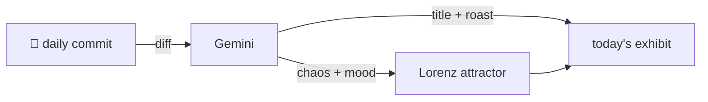

### Hey 👋

I'm Urav. I build things with code.

---

#### 📌 Featured Commit

Every day a bot grabs a commit (one of mine, someone I follow, or a stranger's), an AI names and roasts it, and it ends up as a strange attractor.

<!-- ENTROPY:START -->

### The Ghost Resume

Chaos ██████░░░░ 65 · Mood $\color{#7D889A}{\blacksquare}$ #7D889A

[7wik-pk/portfolio](https://github.com/7wik-pk/portfolio) by [@7wik-pk](https://github.com/7wik-pk) · [`860e766`](https://github.com/7wik-pk/portfolio/commit/860e76605140ed283561fb8822ba2ccd21576e14)

~~~
update gen resume - add nep experience
~~~

Interesting trick to "add nep experience" while registering no text changes. Either the resume is a generated artifact not committed here, or 'nep experience' involves staring intently at the code without touching it. Call me suspicious.

captured 2026-10-01

<!-- ENTROPY:END -->

---

What is this?

 

```mermaid
flowchart LR
    commit["🌌 daily commit"] -->|diff| gemini["Gemini"]
    gemini -->|chaos + mood| attractor["Lorenz attractor"]
    gemini -->|title + roast| exhibit["today's exhibit"]
    attractor --> exhibit
```

A GitHub Action runs daily and picks a commit: mine if I've pushed recently, otherwise something from my network or a starred repo, and the Linux genesis commit as a last resort. Gemini gives it a name, a roast, a chaos score (0-100), and a mood color. Those become a [Lorenz attractor](https://en.wikipedia.org/wiki/Lorenz_system): chaos controls how wild the butterfly gets, mood tints the gradient, and the commit hash sets the starting point. The math is identical every run, so the commit is the only thing that changes the picture.

[See the code →](./entropy)

