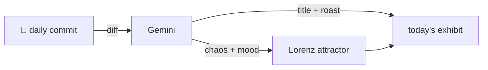

### Hey 👋

I'm Urav. I build things with code.

---

#### 📌 Featured Commit

Every day a bot grabs a commit (one of mine, someone I follow, or a stranger's), an AI names and roasts it, and it ends up as a strange attractor.

<!-- ENTROPY:START -->

### The Multi-Track Maestro

Chaos ████████░░ 85 · Mood $\color{#B22222}{\blacksquare}$ #B22222

[srbhr/Resume-Matcher](https://github.com/srbhr/Resume-Matcher) by [@srbhr](https://github.com/srbhr) · [`9c05e42`](https://github.com/srbhr/Resume-Matcher/commit/9c05e423dfde44a5b4bb398d2dc7507194252ded)

~~~
Merge pull request #1010 from srbhr/feat/multi-track-masters

feat: multi-track master resumes, harness-steered bullet selection, and resume duplication
~~~

A tectonic shift in the fundamental "master resume" invariant, completely re-architecting how primary content is managed. Introducing iterative PDF rendering to curate bullet selection on top of LLM scoring for page-fit is audacious and brilliantly ambitious, yet adds terrifying levels of coupled state and execution complexity. This isn't just a feature; it's a new foundational pillar built with surgical precision amidst existing constraints.

captured 2026-09-30

<!-- ENTROPY:END -->

---

What is this?

 

```mermaid
flowchart LR
    commit["🌌 daily commit"] -->|diff| gemini["Gemini"]
    gemini -->|chaos + mood| attractor["Lorenz attractor"]
    gemini -->|title + roast| exhibit["today's exhibit"]
    attractor --> exhibit
```

A GitHub Action runs daily and picks a commit: mine if I've pushed recently, otherwise something from my network or a starred repo, and the Linux genesis commit as a last resort. Gemini gives it a name, a roast, a chaos score (0-100), and a mood color. Those become a [Lorenz attractor](https://en.wikipedia.org/wiki/Lorenz_system): chaos controls how wild the butterfly gets, mood tints the gradient, and the commit hash sets the starting point. The math is identical every run, so the commit is the only thing that changes the picture.

[See the code →](./entropy)

