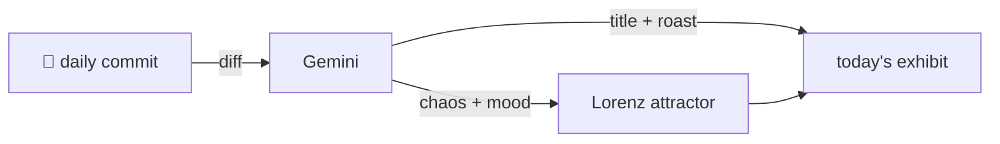

### Hey 👋

I'm Urav. I build things with code.

---

#### 📌 Featured Commit

Every day a bot grabs a commit (one of mine, someone I follow, or a stranger's), an AI names and roasts it, and it ends up as a strange attractor.

<!-- ENTROPY:START -->

### Operator's Unseen Spaces

Chaos ██████░░░░ 65 · Mood $\color{#34568B}{\blacksquare}$ #34568B

[github/spec-kit](https://github.com/github/spec-kit) by [@huiq777](https://github.com/huiq777) · [`838f118`](https://github.com/github/spec-kit/commit/838f1184d1b2ed254a99e8b818dbc23aa80a7f1f)

~~~
fix(workflows): split expression operators across any whitespace (#4801)

The evaluator matched word operators by their surrounding spaces
(" or ", " and ", " in ", " not in ", a leading "not "), so an operator
next to a newline or tab was never spli
…
~~~

Oh, the classic parser bug: assuming specific whitespace when the world (and YAML) throws every variety at you. This isn't just a fix; it's a fundamental alignment with how human-written expressions actually look. Bravo for squashing such a subtle, yet silently disruptive, bug in a crucial evaluator. Also, interesting to see AI assistance on a foundational parsing problem like this.

captured 2026-10-02

<!-- ENTROPY:END -->

---

What is this?

 

```mermaid
flowchart LR
    commit["🌌 daily commit"] -->|diff| gemini["Gemini"]
    gemini -->|chaos + mood| attractor["Lorenz attractor"]
    gemini -->|title + roast| exhibit["today's exhibit"]
    attractor --> exhibit
```

A GitHub Action runs daily and picks a commit: mine if I've pushed recently, otherwise something from my network or a starred repo, and the Linux genesis commit as a last resort. Gemini gives it a name, a roast, a chaos score (0-100), and a mood color. Those become a [Lorenz attractor](https://en.wikipedia.org/wiki/Lorenz_system): chaos controls how wild the butterfly gets, mood tints the gradient, and the commit hash sets the starting point. The math is identical every run, so the commit is the only thing that changes the picture.

[See the code →](./entropy)

