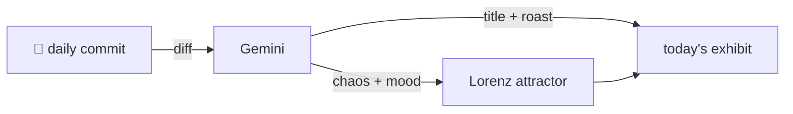

### Hey 👋

I'm Urav. I build things with code.

---

#### 📌 Featured Commit

Every day a bot grabs a commit (one of mine, someone I follow, or a stranger's), an AI names and roasts it, and it ends up as a strange attractor.

<!-- ENTROPY:START -->

### Ruff Code, Tight Style

Chaos █░░░░░░░░░ 15 · Mood $\color{#6A5ACD}{\blacksquare}$ #6A5ACD

[srbhr/Resume-Matcher](https://github.com/srbhr/Resume-Matcher) by [@srbhr](https://github.com/srbhr) · [`63fc344`](https://github.com/srbhr/Resume-Matcher/commit/63fc344a9a59a79db6fa9d96aff188dc9faf545b)

~~~
Merge pull request #1016 from srbhr/chore/setup-backend-ruff

chore: configure ruff linter and formatter for backend
~~~

A classic "tear off the band-aid" move: inflicting a single, wide-reaching formatting pass with Ruff for immediate code hygiene and future consistency. While the diff looks monstrous, the semantic impact is zero, yielding long-term benefits for maintainability and reduced cognitive load. Excellent housecleaning.

captured 2026-10-05

<!-- ENTROPY:END -->

---

What is this?

 

```mermaid
flowchart LR
    commit["🌌 daily commit"] -->|diff| gemini["Gemini"]
    gemini -->|chaos + mood| attractor["Lorenz attractor"]
    gemini -->|title + roast| exhibit["today's exhibit"]
    attractor --> exhibit
```

A GitHub Action runs daily and picks a commit: mine if I've pushed recently, otherwise something from my network or a starred repo, and the Linux genesis commit as a last resort. Gemini gives it a name, a roast, a chaos score (0-100), and a mood color. Those become a [Lorenz attractor](https://en.wikipedia.org/wiki/Lorenz_system): chaos controls how wild the butterfly gets, mood tints the gradient, and the commit hash sets the starting point. The math is identical every run, so the commit is the only thing that changes the picture.

[See the code →](./entropy)

