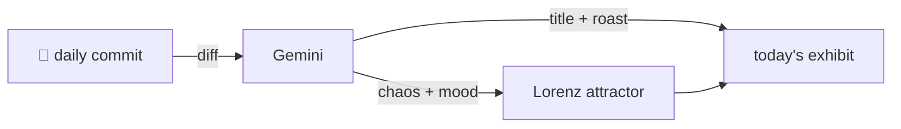

### Hey 👋

I'm Urav. I build things with code.

---

#### 📌 Featured Commit

Every day a bot grabs a commit (one of mine, someone I follow, or a stranger's), an AI names and roasts it, and it ends up as a strange attractor.

<!-- ENTROPY:START -->

### The Parameter Gauntlet

Chaos ███████░░░ 75 · Mood $\color{#36454F}{\blacksquare}$ #36454F

[affaan-m/ECC](https://github.com/affaan-m/ECC) by [@haelyra](https://github.com/haelyra) · [`4eb71d9`](https://github.com/affaan-m/ECC/commit/4eb71d92a39cab44ad40ac9d8a6a5ccb4029d6c2)

~~~
Merge pull request #3484 from affaan-m/integration/ecc-043-20261009-verified

fix: guard literal Git include redirects and env split arguments
~~~

This patch is a fortress for Git security, methodically plugging arcane bypass vectors like `include.path` and meticulously de-obfuscating `env --split-string` arguments. The level of shell-parsing paranoia demonstrated here is precisely the rigor required for truly robust hooks. Top-notch defensive engineering.

captured 2026-10-10

<!-- ENTROPY:END -->

---

What is this?

 

```mermaid
flowchart LR
    commit["🌌 daily commit"] -->|diff| gemini["Gemini"]
    gemini -->|chaos + mood| attractor["Lorenz attractor"]
    gemini -->|title + roast| exhibit["today's exhibit"]
    attractor --> exhibit
```

A GitHub Action runs daily and picks a commit: mine if I've pushed recently, otherwise something from my network or a starred repo, and the Linux genesis commit as a last resort. Gemini gives it a name, a roast, a chaos score (0-100), and a mood color. Those become a [Lorenz attractor](https://en.wikipedia.org/wiki/Lorenz_system): chaos controls how wild the butterfly gets, mood tints the gradient, and the commit hash sets the starting point. The math is identical every run, so the commit is the only thing that changes the picture.

[See the code →](./entropy)

