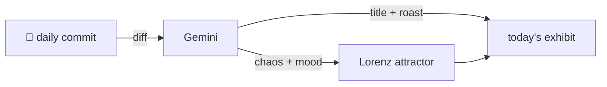

### Hey 👋

I'm Urav. I build things with code.

---

#### 📌 Featured Commit

Every day a bot grabs a commit (one of mine, someone I follow, or a stranger's), an AI names and roasts it, and it ends up as a strange attractor.

<!-- ENTROPY:START -->

### Unadorned Cycling

Chaos ░░░░░░░░░░ 0 · Mood $\color{#7F8C8D}{\blacksquare}$ #7F8C8D

[murtazahr/murtazahr](https://github.com/murtazahr/murtazahr) by [@murtazahr](https://github.com/murtazahr) · [`d82389d`](https://github.com/murtazahr/murtazahr/commit/d82389d7649d7af80745b0008b0bef35396bd68c)

~~~
Merge pull request #4 from murtazahr/claude/github-readme-profile-57vfhv

Drop the 🔁 emoji from the cycling caption
~~~

A grand act of stylistic purification, ridding the repository of a single, highly inconvenient emoji. The sheer audacity of committing such a surgical strike is almost awe-inspiring. Or, you know, it's just removing an emoji.

captured 2026-09-29

<!-- ENTROPY:END -->

---

What is this?

 

```mermaid
flowchart LR
    commit["🌌 daily commit"] -->|diff| gemini["Gemini"]
    gemini -->|chaos + mood| attractor["Lorenz attractor"]
    gemini -->|title + roast| exhibit["today's exhibit"]
    attractor --> exhibit
```

A GitHub Action runs daily and picks a commit: mine if I've pushed recently, otherwise something from my network or a starred repo, and the Linux genesis commit as a last resort. Gemini gives it a name, a roast, a chaos score (0-100), and a mood color. Those become a [Lorenz attractor](https://en.wikipedia.org/wiki/Lorenz_system): chaos controls how wild the butterfly gets, mood tints the gradient, and the commit hash sets the starting point. The math is identical every run, so the commit is the only thing that changes the picture.

[See the code →](./entropy)

