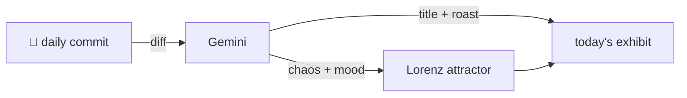

### Hey 👋

I'm Urav. I build things with code.

---

#### 📌 Featured Commit

Every day a bot grabs a commit (one of mine, someone I follow, or a stranger's), an AI names and roasts it, and it ends up as a strange attractor.

<!-- ENTROPY:START -->

### Git's Primal Cut

Chaos █████████░ 95 · Mood $\color{#D65500}{\blacksquare}$ #D65500

[torvalds/linux](https://github.com/torvalds/linux) by [@Unknown](https://github.com/Unknown) · [`1da177e`](https://github.com/torvalds/linux/commit/1da177e4c3f41524e886b7f1b8a0c1fc7321cac2)

~~~
Linux-2.6.12-rc2

Initial git repository build. I'm not bothering with the full history,
even though we have it. We can create a separate "historical" git
archive of that later if we want to, and in the meantime it's about
3.2GB when imported into gi
…
~~~

This commit is pure Linus: audacious pragmatism overriding historical purity to jump-start Git, despite it being 3.2GB shy of full context. The voluminous "BK-usage" documentation, a literal how-to for its predecessor, perfectly captures the lingering ghosts of BitKeeper in what was supposed to be a clean slate.

captured 2026-09-27

<!-- ENTROPY:END -->

---

What is this?

 

```mermaid
flowchart LR
    commit["🌌 daily commit"] -->|diff| gemini["Gemini"]
    gemini -->|chaos + mood| attractor["Lorenz attractor"]
    gemini -->|title + roast| exhibit["today's exhibit"]
    attractor --> exhibit
```

A GitHub Action runs daily and picks a commit: mine if I've pushed recently, otherwise something from my network or a starred repo, and the Linux genesis commit as a last resort. Gemini gives it a name, a roast, a chaos score (0-100), and a mood color. Those become a [Lorenz attractor](https://en.wikipedia.org/wiki/Lorenz_system): chaos controls how wild the butterfly gets, mood tints the gradient, and the commit hash sets the starting point. The math is identical every run, so the commit is the only thing that changes the picture.

[See the code →](./entropy)

