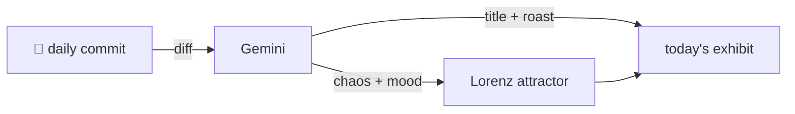

### Hey 👋

I'm Urav. I build things with code.

---

#### 📌 Featured Commit

Every day a bot grabs a commit (one of mine, someone I follow, or a stranger's), an AI names and roasts it, and it ends up as a strange attractor.

<!-- ENTROPY:START -->

### AI's Humbling Reversion

Chaos ███████░░░ 70 · Mood $\color{#607d8b}{\blacksquare}$ #607d8b

[github/spec-kit](https://github.com/github/spec-kit) by [@KSchlobohm](https://github.com/KSchlobohm) · [`ae5ade7`](https://github.com/github/spec-kit/commit/ae5ade7234be5cb1d975f736c4e06dd46d1326d6)

~~~
Revert community submission intake and outcome reporting changes (#4831)

Create space for additional hosted validation before proceeding with or reintroducing the changes from #4829.

Assisted-by: GitHub Copilot App (model: GPT-5.6 Sol, autonomous)

…
~~~

A classic 'we tried, it failed, back to basics' moment for AI-driven workflows. The elaborate, flexible submission intake system with guaranteed outcome comments, likely implemented with Copilot's aid, proved too flaky and is now brutally undone, complete with deleting dedicated tests. Back to strict title prefix checks for these submission types; probably for the best until more robust 'hosted validation' (i.e., human oversight) is ready.

captured 2026-10-04

<!-- ENTROPY:END -->

---

What is this?

 

```mermaid
flowchart LR
    commit["🌌 daily commit"] -->|diff| gemini["Gemini"]
    gemini -->|chaos + mood| attractor["Lorenz attractor"]
    gemini -->|title + roast| exhibit["today's exhibit"]
    attractor --> exhibit
```

A GitHub Action runs daily and picks a commit: mine if I've pushed recently, otherwise something from my network or a starred repo, and the Linux genesis commit as a last resort. Gemini gives it a name, a roast, a chaos score (0-100), and a mood color. Those become a [Lorenz attractor](https://en.wikipedia.org/wiki/Lorenz_system): chaos controls how wild the butterfly gets, mood tints the gradient, and the commit hash sets the starting point. The math is identical every run, so the commit is the only thing that changes the picture.

[See the code →](./entropy)

