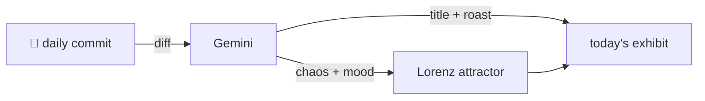

### Hey 👋

I'm Urav. I build things with code.

---

#### 📌 Featured Commit

Every day a bot grabs a commit (one of mine, someone I follow, or a stranger's), an AI names and roasts it, and it ends up as a strange attractor.

<!-- ENTROPY:START -->

### Marketplace Update Wisdom

Chaos ░░░░░░░░░░ 2 · Mood $\color{#ADD8E6}{\blacksquare}$ #ADD8E6

[mattpocock/skills](https://github.com/mattpocock/skills) by [@mattpocock](https://github.com/mattpocock) · [`dd400c3`](https://github.com/mattpocock/skills/commit/dd400c3ad65e57c06f05e832e0aac92c7992f34d)

~~~
Merge pull request #1195 from mattpocock/readme-install-marketplace-update

README: run marketplace update when the plugin isn't found
~~~

This documentation update acknowledges the real friction of plugin distribution and slow marketplace refreshes. It's a pragmatic addition, guiding users through an inevitable 'plugin not found' scenario rather than letting them fumble. Good, simple user experience that heads off a support ticket.

captured 2026-10-07

<!-- ENTROPY:END -->

---

What is this?

 

```mermaid
flowchart LR
    commit["🌌 daily commit"] -->|diff| gemini["Gemini"]
    gemini -->|chaos + mood| attractor["Lorenz attractor"]
    gemini -->|title + roast| exhibit["today's exhibit"]
    attractor --> exhibit
```

A GitHub Action runs daily and picks a commit: mine if I've pushed recently, otherwise something from my network or a starred repo, and the Linux genesis commit as a last resort. Gemini gives it a name, a roast, a chaos score (0-100), and a mood color. Those become a [Lorenz attractor](https://en.wikipedia.org/wiki/Lorenz_system): chaos controls how wild the butterfly gets, mood tints the gradient, and the commit hash sets the starting point. The math is identical every run, so the commit is the only thing that changes the picture.

[See the code →](./entropy)

