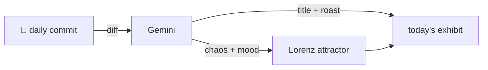

### Hey 👋

I'm Urav. I build things with code.

---

#### 📌 Featured Commit

Every day a bot grabs a commit (one of mine, someone I follow, or a stranger's), an AI names and roasts it, and it ends up as a strange attractor.

<!-- ENTROPY:START -->

### The Inter-Agent Instruction Manual

Chaos ██████░░░░ 65 · Mood $\color{#3A87AD}{\blacksquare}$ #3A87AD

[mattpocock/skills](https://github.com/mattpocock/skills) by [@mattpocock](https://github.com/mattpocock) · [`b0618bc`](https://github.com/mattpocock/skills/commit/b0618bc436ad893b3c5e84e55fba86586d34a404)

~~~
docs(readme): lead with self-updating installs (#1218)

* docs(readme): per-agent install instructions

Copilot and Codex install the plugin via the repo's own marketplace,
Gemini CLI via two --path installs, and Cursor, OpenCode, Devin,
…
~~~

The ultimate meta commit: AI co-authorship for documentation detailing complex AI agent installations. This change meticulously dissects the fragmented agent ecosystem, outlining every nuance from marketplace updates to manual re-runs. It truly highlights just how messy getting one AI to run another's skills can be, even with meticulous documentation efforts.

captured 2026-10-09

<!-- ENTROPY:END -->

---

What is this?

 

```mermaid
flowchart LR
    commit["🌌 daily commit"] -->|diff| gemini["Gemini"]
    gemini -->|chaos + mood| attractor["Lorenz attractor"]
    gemini -->|title + roast| exhibit["today's exhibit"]
    attractor --> exhibit
```

A GitHub Action runs daily and picks a commit: mine if I've pushed recently, otherwise something from my network or a starred repo, and the Linux genesis commit as a last resort. Gemini gives it a name, a roast, a chaos score (0-100), and a mood color. Those become a [Lorenz attractor](https://en.wikipedia.org/wiki/Lorenz_system): chaos controls how wild the butterfly gets, mood tints the gradient, and the commit hash sets the starting point. The math is identical every run, so the commit is the only thing that changes the picture.

[See the code →](./entropy)

