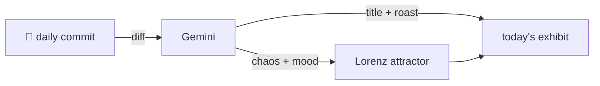

### Hey 👋

I'm Urav. I build things with code.

---

#### 📌 Featured Commit

Every day a bot grabs a commit (one of mine, someone I follow, or a stranger's), an AI names and roasts it, and it ends up as a strange attractor.

<!-- ENTROPY:START -->

### Code Quality Ascendant

Chaos ██░░░░░░░░ 25 · Mood $\color{#4A6C69}{\blacksquare}$ #4A6C69

[urav06/ship-of-theseus](https://github.com/urav06/ship-of-theseus) by [@urav06](https://github.com/urav06) · [`1d4ce47`](https://github.com/urav06/ship-of-theseus/commit/1d4ce4791e058051c69d8578f6ec679ddee41805)

~~~
tighten ruff and ty, point vscode at homebrew, gate complexity
~~~

A fantastic piece of work. The tightening of linting and type checking is admirable, but introducing a complexity gate via `complexipy` at the pre-commit stage? That's proactive genius. This commit isn't just cleaning up; it's building a fortress against future tech debt and enforcing serious engineering discipline.

captured 2026-09-28

<!-- ENTROPY:END -->

---

What is this?

 

```mermaid
flowchart LR
    commit["🌌 daily commit"] -->|diff| gemini["Gemini"]
    gemini -->|chaos + mood| attractor["Lorenz attractor"]
    gemini -->|title + roast| exhibit["today's exhibit"]
    attractor --> exhibit
```

A GitHub Action runs daily and picks a commit: mine if I've pushed recently, otherwise something from my network or a starred repo, and the Linux genesis commit as a last resort. Gemini gives it a name, a roast, a chaos score (0-100), and a mood color. Those become a [Lorenz attractor](https://en.wikipedia.org/wiki/Lorenz_system): chaos controls how wild the butterfly gets, mood tints the gradient, and the commit hash sets the starting point. The math is identical every run, so the commit is the only thing that changes the picture.

[See the code →](./entropy)

