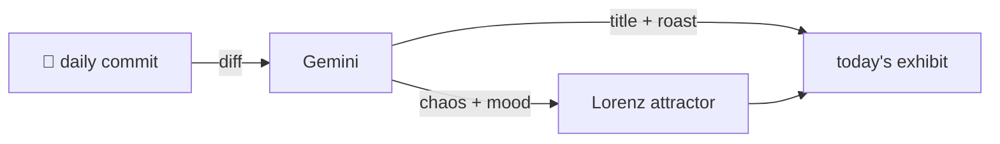

### Hey 👋

I'm Urav. I build things with code.

---

#### 📌 Featured Commit

Every day a bot grabs a commit (one of mine, someone I follow, or a stranger's), an AI names and roasts it, and it ends up as a strange attractor.

<!-- ENTROPY:START -->

### The Temporal Beta Dispatch

Chaos ██░░░░░░░░ 25 · Mood $\color{#A7D9F0}{\blacksquare}$ #A7D9F0

[palmier-io/palmier-pro](https://github.com/palmier-io/palmier-pro) by [@htin1](https://github.com/htin1) · [`7a140c1`](https://github.com/palmier-io/palmier-pro/commit/7a140c15ca628a8aa67bb5aaae7c6994474f73b9)

~~~
[build] Publish v1.0.0-beta.4 appcast
~~~

Just another mechanical appcast update, a standard procedure for a beta release. The only thing remotely notable is that curiously futuristic `pubDate`. Someone's planning way, way ahead for their betas, or perhaps has a malfunctioning clock.

captured 2026-11-20

<!-- ENTROPY:END -->

---

What is this?

 

```mermaid
flowchart LR
    commit["🌌 daily commit"] -->|diff| gemini["Gemini"]
    gemini -->|chaos + mood| attractor["Lorenz attractor"]
    gemini -->|title + roast| exhibit["today's exhibit"]
    attractor --> exhibit
```

A GitHub Action runs daily and picks a commit: mine if I've pushed recently, otherwise something from my network or a starred repo, and the Linux genesis commit as a last resort. Gemini gives it a name, a roast, a chaos score (0-100), and a mood color. Those become a [Lorenz attractor](https://en.wikipedia.org/wiki/Lorenz_system): chaos controls how wild the butterfly gets, mood tints the gradient, and the commit hash sets the starting point. The math is identical every run, so the commit is the only thing that changes the picture.

[See the code →](./entropy)

